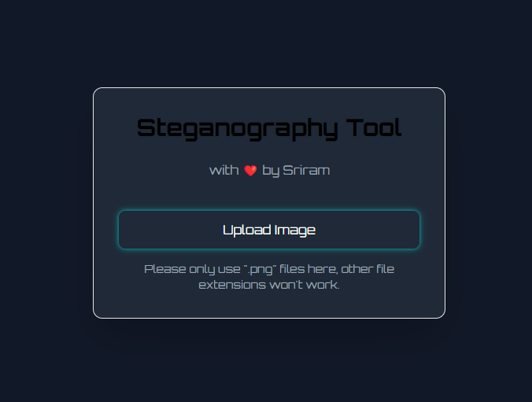
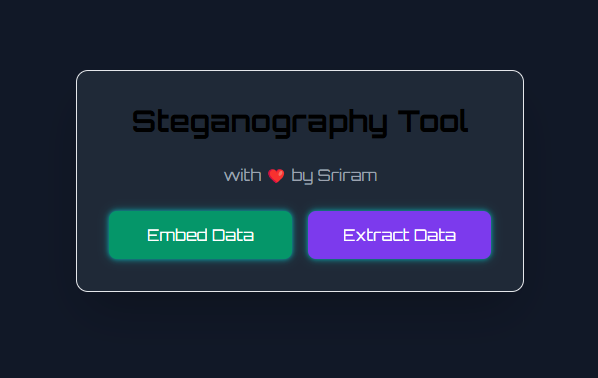
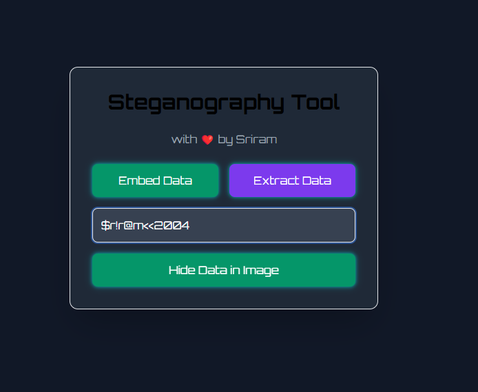
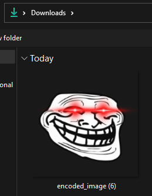

# Steganography

Steganography is the technique of hiding secret data within digital media like images, audio, or text to ensure covert communication

## Installation

Use the package manager [pip](https://pip.pypa.io/en/stable/) to install dependencies.

```bash
pip install flask PIL
```

## Usage

Go to ui.py , and run in a new terminal 
```bash
python ui.py
```

## Screenshots

### Main page 


### Functions 



### Embedding And Extracting 




### Encoded Image Example 


